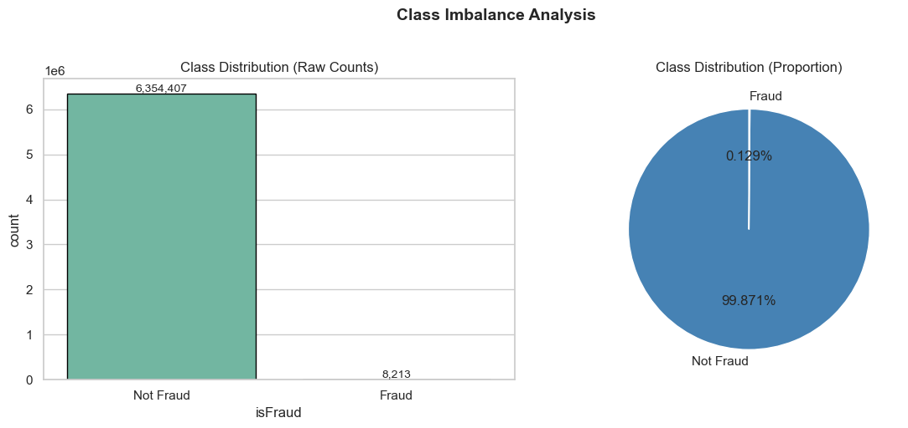
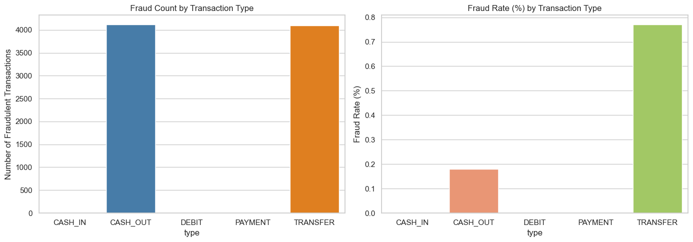
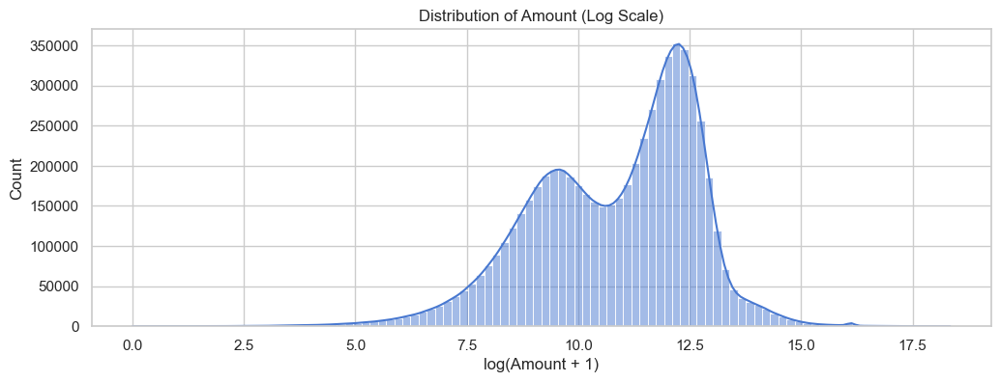
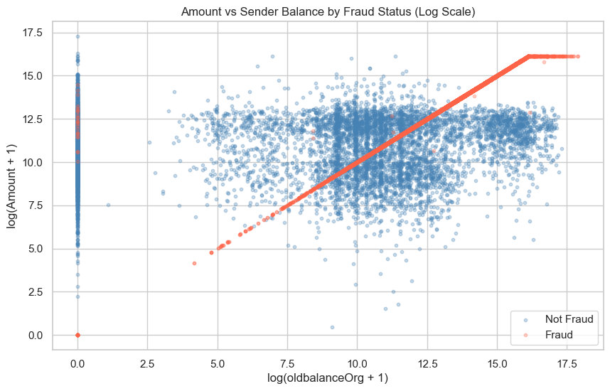

# Fraud Detection on Financial Transactions - Data Analytics Portfolio

**Author:** Ozor Moya 

**Date:** 04/19/2026

---

## Project Overview

This project builds a **fraud detection system** for money transactions using the synthetic dataset. Starting from 6.36 million transactions, a complete data science workflow was applied — from exploratory data analysis through feature engineering to model development and evaluation.

The core challenge is detecting fraudulent transactions that represent only **0.129%** of all activity — a severe class imbalance that makes traditional accuracy metrics misleading and requires careful model design.

---

## Project Structure

```
P2PortfolioProject/
├── Code/
│   ├── 01_explore.ipynb        # Exploratory Data Analysis (EDA)
│   ├── 02_transform.ipynb      # Data Cleaning & Feature Engineering
│   └── 03_model.ipynb          # Model Training, Tuning & Evaluation
├── Data/
│   ├── PS_20174392719_1491204439457_log.csv   # Raw dataset
│   └── model_ready.csv                        # Cleaned dataset
├── Docs/
│   └── *.png                   # EDA visualizations
├── report/
│   └── report.md               # Answers to TLAB questions
└── README.md
```

---

## Dataset

### Features

| Column | Description |
|---|---|
| `step` | Time unit (1 step = 1 hour) |
| `type` | Transaction type (CASH_OUT, PAYMENT, CASH_IN, TRANSFER, DEBIT) |
| `amount` | Transaction amount |
| `nameOrig` | Sender account ID |
| `oldbalanceOrg` | Sender balance before transaction |
| `newbalanceOrig` | Sender balance after transaction |
| `nameDest` | Receiver account ID |
| `oldbalanceDest` | Receiver balance before transaction |
| `newbalanceDest` | Receiver balance after transaction |
| `isFraud` | Target variable (1 = fraud, 0 = legitimate) |
| `isFlaggedFraud` | System flag (mostly zero — dropped) |

---

## `explore.ipynb` — Exploratory Data Analysis

### Univariate Analysis
- All financial columns are **heavily right-skewed** — log transformation applied for visualization
- Balance columns show **significant zero inflation** — linked to merchant accounts and drained sender accounts
- `amount` reveals a **bimodal distribution** — two distinct transaction size clusters
- `step` shows cyclical patterns with activity concentrated in the **first 400 hours**
- Target variable `isFraud` is severely imbalanced at **0.129% fraud rate**

### Bivariate Analysis
- Fraud is **exclusively concentrated** in TRANSFER and CASH_OUT transactions
- TRANSFER has a **4x higher fraud rate** (0.77%) than CASH_OUT (0.18%)
- Fraudulent transactions show sender balances **draining to zero** — strongest single fraud signal
- Fraud count remains **stable across all time steps** — time is a weak predictor

### Multivariate Analysis
- Scatter plot of amount vs `oldbalanceOrg` reveals fraud forms a **clear diagonal line** — fraudsters drain exactly what is available regardless of balance size
- Correlation heatmap confirms **multicollinearity** between balance column pairs (r=1.00 and r=0.98)
- All features show **low linear correlation** with `isFraud` — confirming the need for non-linear models

### Key Visualizations

| | |
|---|---|
|  |  |
|  |  |

---

## `transform.ipynb` — Data Cleaning & Feature Engineering

### Cleaning Steps
1. **Verified zero null values and duplicates**
2. **Filtered to TRANSFER and CASH_OUT only** — removed 3.59M rows with zero fraud cases, improving fraud rate from 0.129% → 0.296%
3. **Dropped unnecessary columns** — `nameOrig`, `nameDest`, `isFlaggedFraud`
4. **Investigated balance error features** — clipped negative `errorBalanceDest` values after confirming they carry no fraud signal (0.10% fraud rate vs 0.35% for non-negative values)

### Feature Engineering
Two balance difference features were created to address multicollinearity and capture account drainage behavior:

```python
# How much the sender's balance decreased
df['BalancediffOrig'] = df['oldbalanceOrg'] - df['newbalanceOrig']

# How much the destination's balance increased  
df['BalancediffDest'] = df['newbalanceDest'] - df['oldbalanceDest']
```

**`BalancediffOrig`** became the most important feature in both models — validating the account drainage hypothesis from EDA.

### Encoding
`type` column label-encoded using one-hot encoding → `type_TRANSFER` (1 = TRANSFER, 0 = CASH_OUT)

### Final Dataset
- **Rows:** 2,770,409
- **Features:** 9
- **Fraud rate:** 0.296%
- **Saved as:** `model_ready.csv`

---

## `model.ipynb` — Model Training & Evaluation

### Setup
- **Train/test split:** 80/20 with `stratify=y` to preserve fraud rate
- **Class imbalance:** Handled via `class_weight='balanced'` for Random Forest
- **Tuning:** RandomizedSearchCV on a 20% stratified sample (443,265 rows) for efficiency

### Models Evaluated

#### Baseline Results

| Model | Precision | Recall | F1 Score | AUC-ROC |
|---|---|---|---|---|
| Random Forest | 0.97 | 0.81 | 0.8834 | 0.9965 |
| Gradient Boosting | 0.97 | 0.54 | 0.6950 | 0.7989 |

#### After Hyperparameter Tuning (RandomizedSearchCV, n_iter=20, cv=5)

| Model | Precision | Recall | F1 Score | AUC-ROC |
|---|---|---|---|---|
| **Random Forest ✅** | **0.91** | **0.87** | **0.8922** | **0.9989** |
| Gradient Boosting | 0.20 | 0.99 | 0.3257 | 0.9986 |

### Best Model — Tuned Random Forest

**Optimal Parameters:**
```python
RandomForestClassifier(
    n_estimators=500,
    max_depth=None,
    min_samples_split=2,
    min_samples_leaf=4,
    max_features='log2',
    class_weight='balanced',
    random_state=42
)
```

**Confusion Matrix:**

|  | Predicted Not Fraud | Predicted Fraud |
|---|---|---|
| **Actual Not Fraud** | 552,396 ✅ | 43 ⚠️ |
| **Actual Fraud** | 214 ❌ | 1,429 ✅ |

- **1,429 fraud cases correctly caught** out of 1,643
- Only **43 false alarms** out of 552,439 legitimate transactions

### Feature Importance

Both models consistently ranked `BalancediffOrig` as the most important feature — confirming the account drainage pattern identified during EDA.

| Rank | Random Forest | Gradient Boosting |
|---|---|---|
| 1st | BalancediffOrig (0.31) | BalancediffOrig (0.58) |
| 2nd | oldbalanceOrg (0.21) | amount (0.14) |
| 3rd | BalancediffDest (0.11) | newbalanceDest (0.11) |
| Last | type_TRANSFER | oldbalanceDest |

---

## Hypothesis Validation

| Hypothesis | Result |
|---|---|
| H1 — Transaction type is a strong fraud predictor | ⚠️ Partially supported |
| H2 — Account drainage is the strongest fraud signal | ✅ Supported |
| H3 — Sender balance features outperform destination features | ✅ Supported |
| H4 — Accuracy is a misleading evaluation metric | ✅ Supported |
| H5 — Step is among the least important features | ✅ Supported |
| H6 — No single feature can reliably detect fraud alone | ✅ Supported |
| H7 — Removing multicollinear features won't hurt performance | ✅ Supported |

---

## Tech Stack


